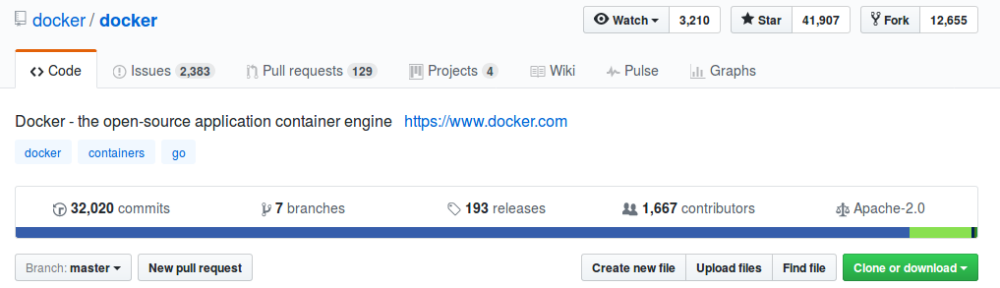

include::includes/_settings.adoc[]

:revealjs_theme: sobkowiak-cg
:speaker: Krzysztof Sobkowiak (http://twitter.com/ksobkowiak[@ksobkowiak])
:speaker-title: The Apache Software Foundation Member, Senior Solution Architect at Capgemini
:speaker-email: krzysztof.sobkowiak@capgemini.com
:speaker-blog: http://krzysztof-sobkowiak.net
:speaker-twitter: http://twitter.com/ksobkowiak[@ksobkowiak]

= Package your Application using Docker

image::images/docker-logo.png[align="center", width="15%"]

[.cover]
--

[.event]
Capgemini Craftsmanship Community #82 +
Wrocław, 28th of April 2017

[.newline]
{speaker}
[.speaker-title]
The Apache Software Foundation Member +
Senior Solution Architect at Capgemini
[.logo-left]
image:{template-images-dir}/feather.png[width="60", link="http://apache.org"]
--

// ***************************************************************************
include::includes/about.adoc[]
include::includes/disclaimer-cg.adoc[]
// ***************************************************************************

== Outline

[.noredheader,cols="50%,50%"]
|===
a|
* Introduction to Docker
* Docker Machine
* Docker Compose
* Swarm Mode
a|
|
|===

// ----------------------------------------------------------------------------

== What is Docker?

* Open source project and company
+

* Used to create containers for software applications

// ----------------------------------------------------------------------------

=== !

* WORA = Write Once Run Anywhere
* PODA = Package Once Deploy Anywhere

// ----------------------------------------------------------------------------
// ----------------------------------------------------------------------------
// ----------------------------------------------------------------------------
// ----------------------------------------------------------------------------
// ----------------------------------------------------------------------------
// ----------------------------------------------------------------------------
// ----------------------------------------------------------------------------
// ----------------------------------------------------------------------------
// ----------------------------------------------------------------------------
// ----------------------------------------------------------------------------

// ***************************************************************************
include::includes/qa-full.adoc[]
include::includes/license-cg.adoc[]
//include::includes/credits.adoc[]
// ***************************************************************************
