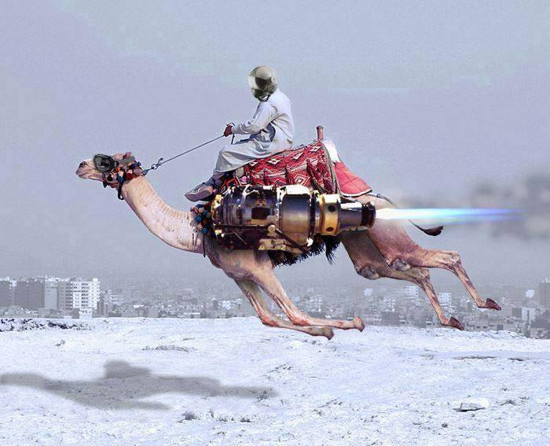

include::includes/_settings.adoc[]

:revealjs_theme: sobkowiak-cg
:speaker: Krzysztof Sobkowiak (http://twitter.com/ksobkowiak[@ksobkowiak])
:speaker-title: The Apache Software Foundation Member, Senior Solution Architect at Capgemini
:speaker-email: krzysztof.sobkowiak@capgemini.com
:speaker-blog: http://krzysztof-sobkowiak.net
:speaker-twitter: http://twitter.com/ksobkowiak[@ksobkowiak]

= Craftsmanship Open Community Session #2

[.cover]
--

[.event]
Capgemini Craftsmanship Community +
Wrocław, 28th of April 2017

[.newline]
{speaker}
[.speaker-title]
The Apache Software Foundation Member +
Senior Solution Architect at Capgemini
[.logo-left]
image:{template-images-dir}/feather.png[width="60", link="http://apache.org"]
--

// ***************************************************************************
include::includes/about.adoc[]
include::includes/disclaimer-cg.adoc[]
// ***************************************************************************

== Outline

[.noredheader,cols="100%,0%"]
|===
a|
* Apps Evolve! Summit -- Services Orchestration Stream summary
* Topic proposal: Fabric8 your Services with Kubernetes & OpenShift
** Package your Application using Docker & Kubernetes
** Resilient Services with Spring Cloud, Docker & Kubernetes
** xPaaS with OpenShift & fabric8
* Topic proposal: Understanding Open Source, the Apache Software Foundation
* Topic proposal: Enterprise Integration Patters with Apache Camel & Apache ActiveMQ (Artemis)
* RoboCAP
a|
|
|===

// ----------------------------------------------------------------------------

== AppsEvolve Summit -- Services Orchestration Stream

// ----------------------------------------------------------------------------

// ----------------------------------------------------------------------------

// ----------------------------------------------------------------------------

== Fabric8 your Services with Kubernetes & OpenShift

// ----------------------------------------------------------------------------

=== !

// ----------------------------------------------------------------------------

=== !

[.medium-text]
Creating business value through software is about speed, safety, iteration, and continuous improvement

// ----------------------------------------------------------------------------

=== !

[.noredheader,cols="38%,4%,58%"]
|===
^.^| image:images/java-microservices-frameworks.png[]
a|
.^a|
* Simple configuration
* Curated dependencies and transitive dependencies
* Built in metrics, monitoring
* Slim profile for deployment (...micro even?)
+
#microprofile
|
|===

// ----------------------------------------------------------------------------

=== !

[.noredheader,cols="48%,4%,48%"]
|===
^.^| image:images/netflix-java-logo.png[width="70%"]
a|
.^a|
* Distributed configuration
* Service Discovery
* Loadbalancing
* Circuit Breakers
* Bulkheading
* Versioning/Routing
* Based on AWS
|
|===

// ----------------------------------------------------------------------------

=== !

image::images/docker-logo.png[align="center"]

// ----------------------------------------------------------------------------
=== What about non-java?

image::images/non-java-languages.png[align="center", width="50%"]

// ----------------------------------------------------------------------------

// ----------------------------------------------------------------------------

// ----------------------------------------------------------------------------

// ----------------------------------------------------------------------------

=== Topics proposal

* Package your Application using Docker & Kubernetes
* Resilient Services with Spring Cloud, Docker & Kubernetes
* xPaaS with OpenShift & fabric8

// ---------------------------------------------------------------------------

=== Topics proposal

[.noredheader,cols="48%,4%,48%"]
|===
^.^a|
* Spring Boot
* WildFly Swarm
* Vert.x
* Dropwizard
a|
^.^| image:images/i-want-you.png[width="55%"]
|
|===

// ----------------------------------------------------------------------------

// ----------------------------------------------------------------------------

// ----------------------------------------------------------------------------

// ----------------------------------------------------------------------------

// ***************************************************************************
include::includes/qa-full.adoc[]
include::includes/license-cg.adoc[]
//include::includes/credits.adoc[]
// ***************************************************************************
