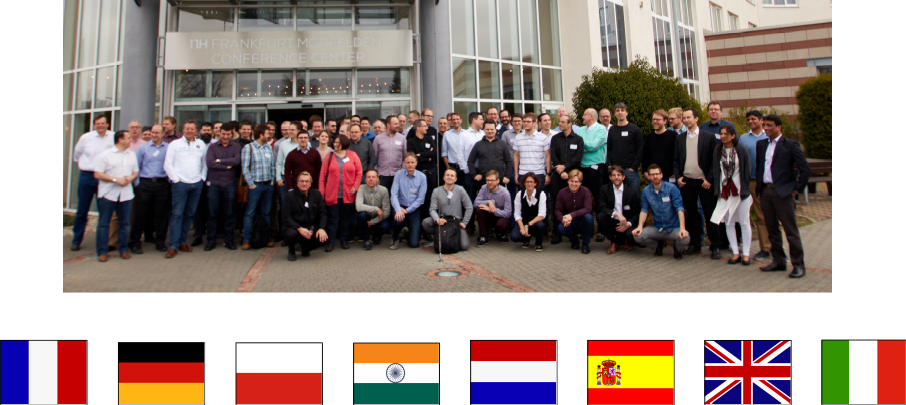

include::includes/_settings.adoc[]

:revealjs_theme: sobkowiak-cg-craftsmanship
:speaker: Krzysztof Sobkowiak (http://twitter.com/ksobkowiak[@ksobkowiak])
:speaker-title: The Apache Software Foundation Member, Senior Solution Architect at Capgemini
:speaker-email: krzysztof.sobkowiak@capgemini.com
:speaker-blog: http://krzysztof-sobkowiak.net
:speaker-twitter: http://twitter.com/ksobkowiak[@ksobkowiak]

= Craftsmanship Open Community Session #3

[.cover]
--

[.event]
Capgemini Craftsmanship Community +
Wrocław, 26th of May 2017

[.newline]
{speaker}
[.speaker-title]
The Apache Software Foundation Member +
Senior Solution Architect at Capgemini
[.logo-left]
image:{template-images-dir}/feather.png[width="60", link="http://apache.org"]
--

// ***************************************************************************
include::includes/about.adoc[]
include::includes/disclaimer-cg.adoc[]
// ***************************************************************************

// ----------------------------------------------------------------------------

== AppsEvolve Summit Report

// ----------------------------------------------------------------------------

=== !

* Mörfelden, 23-25 March 2017

// ----------------------------------------------------------------------------

=== !

[.noredheader,cols="48%,4%,48%"]
|===
.^a|
* Service Orchestration Stream
** Capgemini EiPaaS -- current state
** PaaS Shootout (EiPaaS, PCF, OpenShift, Fabric8)
* devonfw -- a year after AppsEvolve 2016
a|
.^a|image::images/comming-soon.png[align="center",width="100%"]
|
|===

// ----------------------------------------------------------------------------

// ----------------------------------------------------------------------------

// ----------------------------------------------------------------------------

// ----------------------------------------------------------------------------

// ----------------------------------------------------------------------------

// ***************************************************************************
include::includes/qa-full.adoc[]
include::includes/license-cg.adoc[]
//include::includes/credits.adoc[]
// ***************************************************************************
